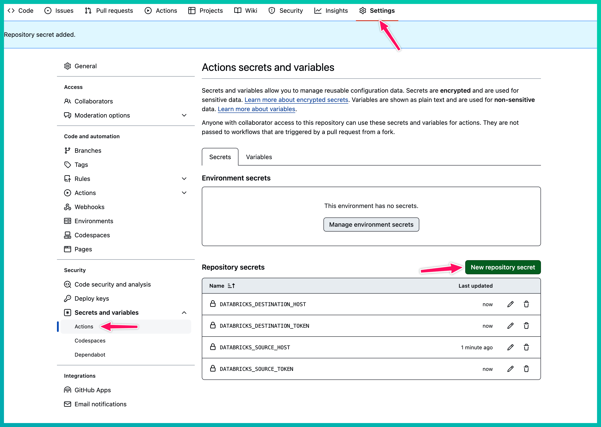
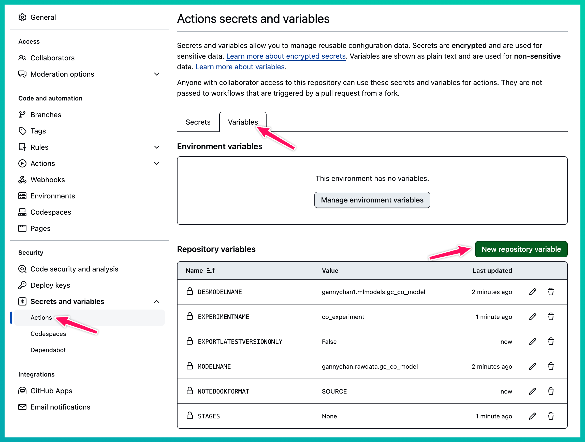

# Unity Catalog : Export Import Ml Models

## Using Github Actions copy ML Models from one UC Metastore to another UC Metastore.

This demo uses the following open source tool.

https://github.com/mlflow/mlflow-export-import

## Method 1: export_import_using_ui_variables.yml

Uses Repository Secrets and Variables.

]

]

## Method 2: export_import_using_dispatch_input.yml

Uses Repository Secrets and Workflow dispatch input (as part of yaml file).

